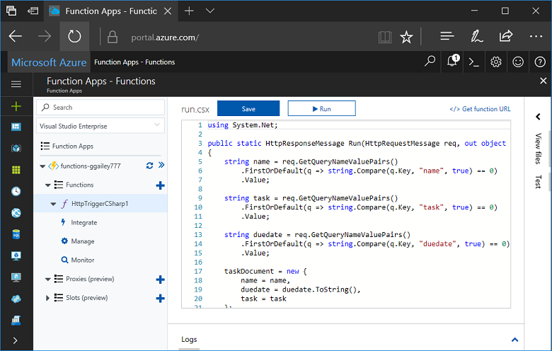
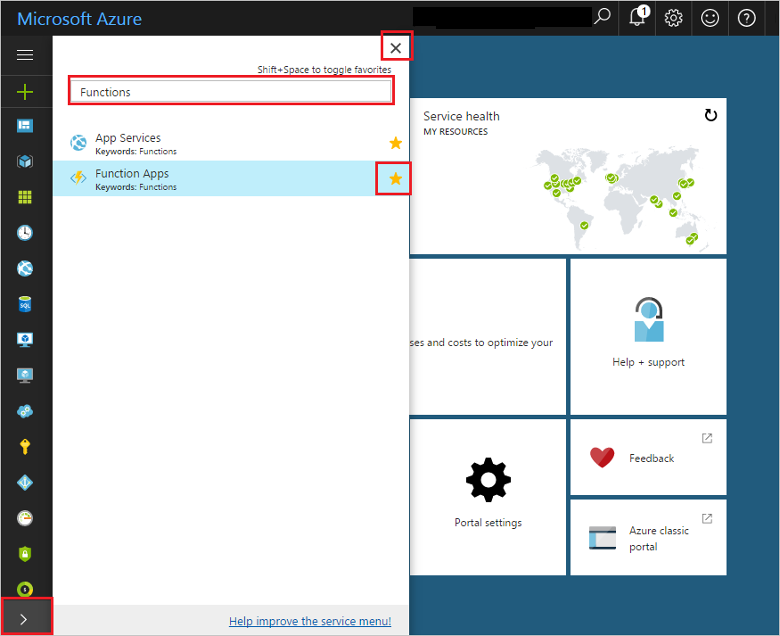
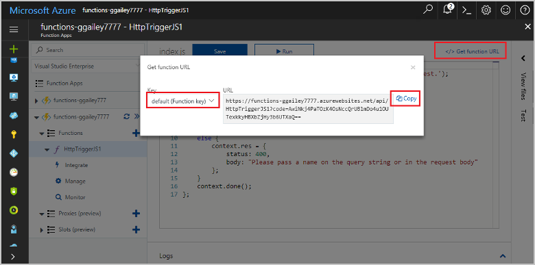
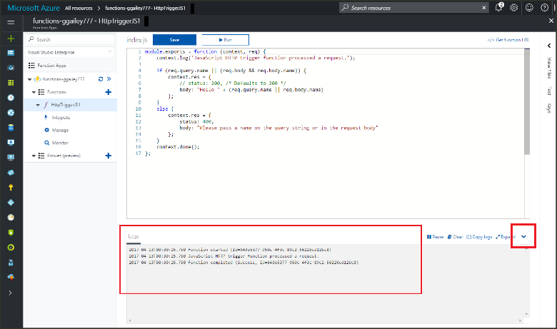

# Lab 1. Create your first function in the Azure portal

Azure Functions lets you execute your code in a [serverless](https://azure.microsoft.com/overview/serverless-computing/) environment without having to first create a VM or publish a web application. In this topic, learn how to use Functions to create a "hello world" function in the Azure portal.

If you don't have an Azure subscription, create a [free account](https://azure.microsoft.com/free/?ref=microsoft.com&utm_source=microsoft.com&utm_medium=docs&utm_campaign=visualstudio) before you begin.

## Log in to Azure

Log in to the [Azure portal](https://portal.azure.com/).

## Create a function app

You must have a function app to host the execution of your functions. A function app lets you group functions as a logic unit for easier management, deployment, and sharing of resources. 

1. Click the **New** button found on the upper left-hand corner of the Azure portal.

1. Click **Compute** > **Function App**. Then, use the function app settings as specified in the table.

    

    | Setting      | Suggested value  | Description                                        |
    | ------------ |  ------- | -------------------------------------------------- |
    | **App name** | Globally unique name | Name that identifies your new function app. Valid characters are `a-z`, `0-9`, and `-`.  | 
    | **Subscription** | Your subscription | The subscription under which this new function app will be created. | 
    | **Resource Group** |  myResourceGroup | Name for the new resource group in which to create your function app. | 
    | **Hosting plan** |   Consumption plan | Hosting plan that defines how resources are allocated to your function app. In the default **Consumption Plan**, resources are added dynamically as required by your functions. You only pay for the time your functions run.   |
    | **Location** | West Europe | Choose a location near you or near other services your functions will access. |
    | **Storage account** |  Globally unique name |  Name of the new storage account used by your function app. Storage account names must be between 3 and 24 characters in length and may contain numbers and lowercase letters only. You can also use an existing account. |

1. Click **Create** to provision and deploy the new function app.

## Favorite Functions in the portal 

If you haven't already done so, add Function Apps to your favorites in the Azure portal. This makes it easier to find your function apps. If you have already done this, skip to the next section. 

1. Log in to the [Azure portal](https://portal.azure.com/).

2. Click the arrow at the bottom left to expand all services, type `Functions` in the **Filter** field, and then click the star next to **Function Apps**.  
 
    

    This adds the Functions icon to the menu on the left of the portal.

3. Close the menu, then scroll down to the bottom to see the Functions icon. Click this icon to see a list of all your function apps. Click your function app to work with functions in this app. 
 
    

Next, you create a function in the new function app.

## Create an HTTP triggered function

1. Expand your new function app, then click the **+** button next to **Functions**.

2.  In the **Get started quickly** page, select **WebHook + API**, **Choose a language** for your function, and click **Create this function**. 
   
    

A function is created in your chosen language using the template for an HTTP triggered function. You can run the new function by sending an HTTP request.

## Test the function

1. In your new function, click **</> Get function URL**, select **default (Function key)**, and then click **Copy**. 

    

2. Paste the function URL into your browser's address bar. Append the query string `&name=<yourname>` to this URL and press the `Enter` key on your keyboard to execute the request. The following is an example of the response returned by the function in the Edge browser:

    

    The request URL includes a key that is required, by default, to access your function over HTTP.   

3. When your function runs, trace information is written to the logs. To see the trace output from the previous execution, return to your function in the portal and click the up arrow at the bottom of the screen to expand **Logs**. 

   

## Next steps

For more information, see [Azure Functions HTTP and webhook bindings](functions-bindings-http-webhook.md).
