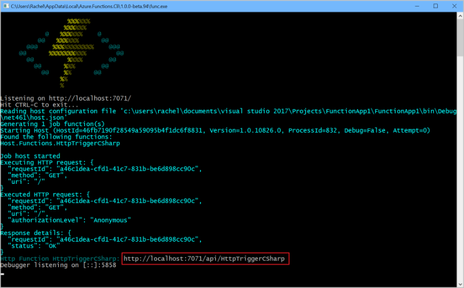

# Lab 2. Create your first function using Visual Studio

Azure Functions lets you execute your code in a [serverless](https://azure.microsoft.com/overview/serverless-computing/) environment without having to first create a VM or publish a web application.

In this topic, you learn how to use the Visual Studio 2017 tools for Azure Functions to create and test a "hello world" function locally. You will then publish the function code to Azure. These tools are available as part of the Azure development workload in Visual Studio 2017 version 15.3, or a later version.

## Prerequisites

To complete this tutorial, install:

* [Visual Studio 2017 version 15.3](https://www.visualstudio.com/vs/preview/) or a later version, including the **Azure development** workload.

    
    
>[!NOTE]  
>After you install or upgrade to Visual Studio 2017 version 15.3, you must manually update the Visual Studio 2017 tools for Azure Functions. These additional steps are not required when you install or upgrade to version 15.4 or a later version.  
You can update the tools from the **Tools** menu under **Extensions and Updates...** > **Updates** > **Visual Studio Marketplace** > **Azure Functions and Web Jobs Tools** > **Update**. 

If you don't have an Azure subscription, create a [free account](https://azure.microsoft.com/free/?ref=microsoft.com&utm_source=microsoft.com&utm_medium=docs&utm_campaign=visualstudio) before you begin.

## Create an Azure Functions project in Visual Studio

The Azure Functions project template in Visual Studio creates a project that can be published to a function app in Azure. A function app lets you group functions as a logic unit for easier management, deployment, and sharing of resources.   

1. Right mouse click on the project node in **Solution Explorer**, then choose **Add** > **New Item**. Choose **Azure Function** from the dialog box.

2. In the **New Project** dialog, expand **Visual C#** > **Cloud** node, select **Azure Functions**, type a **Name** for your project, and click **OK**. The function app name must be valid as a C# namespace, so don't use underscores, hyphens, or any other nonalphanumeric characters. 

    

Now that you have created the project, you can create your first function.

## Create the function

1. In **Solution Explorer**, right-click on your project node and select **Add** > **New Item**. Select **Azure Function** and click **Add**.

2. Select **HttpTrigger**, type a **Function Name**, select **Anonymous** for **Access Rights**, and click **Create**. The function created is accessed by an HTTP request from any client. 

    

    A code file is added to your project that contains a class that implements your function code. This code is based on a template, which receives a name value and echos it back. The **FunctionName** attribute sets the name of your function. The **HttpTrigger** attribute indicates the message that triggers the function. 

    

Now that you have created an HTTP-triggered function, you can test it on your local computer.

## Test the function locally

Azure Functions Core Tools lets you run Azure Functions project on your local development computer. You are prompted to install these tools the first time you start a function from Visual Studio.  

1. To test your function, press F5. If prompted, accept the request from Visual Studio to download and install Azure Functions Core (CLI) tools.  You may also need to enable a firewall exception so that the tools can handle HTTP requests.

2. Copy the URL of your function from the Azure Functions runtime output.  

    

3. Paste the URL for the HTTP request into your browser's address bar. Append the query string `?name=<yourname>` to this URL and execute the request. The following shows the response in the browser to the local GET request returned by the function: 

    

4. To stop debugging, click the **Stop** button on the Visual Studio toolbar.

After you have verified that the function runs correctly on your local computer, it's time to publish the project to Azure.

## Publish the project to Azure

You must have a function app in your Azure subscription before you can publish your project. You can create a function app right from Visual Studio.

1. In **Solution Explorer**, right-click the project and select **Publish**. Choose **Create New**  and then click **Publish**. 

    

2. If you haven't already connected Visual Studio to your Azure account, click **Add an account...**.  

3. In the **Create App Service** dialog, use the **Hosting** settings as specified in the following table: 

    

    | Setting      | Suggested value  | Description                                |
    | ------------ |  ------- | -------------------------------------------------- |
    | **App Name** | Globally unique name | Name that uniquely identifies your new function app. |
    | **Subscription** | Choose your subscription | The Azure subscription to use. |
    | **Resource Group** | myResourceGroup |  Name of the resource group in which to create your function app. |
    | **App Service Plan** | Consumption plan | Make sure to choose the **Consumption** under **Size** when you create a new plan.  |
    | **Storage account** | Globally unique name | Use an existing storage account or create a new one.   |

4. Click **Create** to create a function app in Azure with these settings. After the provisioning is complete, make a note of the **Site URL** value, which is the address of your function app in Azure. 

    

## Test your function in Azure

1. Copy the base URL of the function app from the Publish profile page. Replace the `localhost:port` portion of the URL you used when testing the function locally with the new base URL. As before, make sure to append the query string `?name=<yourname>` to this URL and execute the request.

    The URL that calls your HTTP triggered function looks like this:

        http://<functionappname>.azurewebsites.net/api/<functionname>?name=<yourname> 

2. Paste this new URL for the HTTP request into your browser's address bar. The following shows the response in the browser to the remote GET request returned by the function: 

    
 