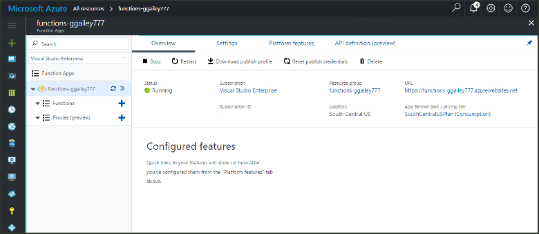

# Lab 3. Create a function in Azure that is triggered by a timer

Learn how to use Azure Functions to create a function that runs based a schedule that you define.

## Prerequisites

To complete this tutorial:

+ If you don't have an Azure subscription, create a [free account](https://azure.microsoft.com/free/?WT.mc_id=A261C142F) before you begin.

## Favorite Functions in the portal 

If you haven't already done so, add Function Apps to your favorites in the Azure portal. This makes it easier to find your function apps. If you have already done this, skip to the next section. 

1. Log in to the [Azure portal](https://portal.azure.com/).

2. Click the arrow at the bottom left to expand all services, type `Functions` in the **Filter** field, and then click the star next to **Function Apps**.  
 
    

    This adds the Functions icon to the menu on the left of the portal.

3. Close the menu, then scroll down to the bottom to see the Functions icon. Click this icon to see a list of all your function apps. Click your function app to work with functions in this app. 
 
    

## Create an Azure Function app

1. Click the **New** button found on the upper left-hand corner of the Azure portal.

1. Click **Compute** > **Function App**. Then, use the function app settings as specified in the table.

    

    | Setting      | Suggested value  | Description                                        |
    | ------------ |  ------- | -------------------------------------------------- |
    | **App name** | Globally unique name | Name that identifies your new function app. Valid characters are `a-z`, `0-9`, and `-`.  | 
    | **Subscription** | Your subscription | The subscription under which this new function app will be created. | 
    | **Resource Group** |  myResourceGroup | Name for the new resource group in which to create your function app. | 
    | **Hosting plan** |   Consumption plan | Hosting plan that defines how resources are allocated to your function app. In the default **Consumption Plan**, resources are added dynamically as required by your functions. You only pay for the time your functions run.   |
    | **Location** | West Europe | Choose a location near you or near other services your functions will access. |
    | **Storage account** |  Globally unique name |  Name of the new storage account used by your function app. Storage account names must be between 3 and 24 characters in length and may contain numbers and lowercase letters only. You can also use an existing account. |

1. Click **Create** to provision and deploy the new function app.

Next, you create a function in the new function app.

## Create a timer triggered function

1. Expand your function app and click the **+** button next to **Functions**. If this is the first function in your function app, select **Custom function**. This displays the complete set of function templates.

    

2. Select the **TimerTrigger** template for your desired language. Then use the settings as specified in the table:

    

    | Setting | Suggested value | Description |
    |---|---|---|
    | **Name your function** | TimerTriggerCSharp1 | Defines the name of your timer triggered function. |
    | **[Schedule](http://en.wikipedia.org/wiki/Cron#CRON_expression)** | 0 \*/1 \* \* \* \* | A six field [CRON expression](http://en.wikipedia.org/wiki/Cron#CRON_expression) that schedules your function to run every minute. |

2. Click **Create**. A function is created in your chosen language that runs every minute.

3. Verify execution by viewing trace information written to the logs.

    

Now, you can change the function's schedule so that it runs less often, such as once every hour. 

## Update the timer schedule

1. Expand your function and click **Integrate**. This is where you define input and output bindings for your function and also set the schedule. 

2. Enter a new **Schedule** value of `0 0 */1 * * *`, and then click **Save**.  

You now have a function that runs once every hour. 
