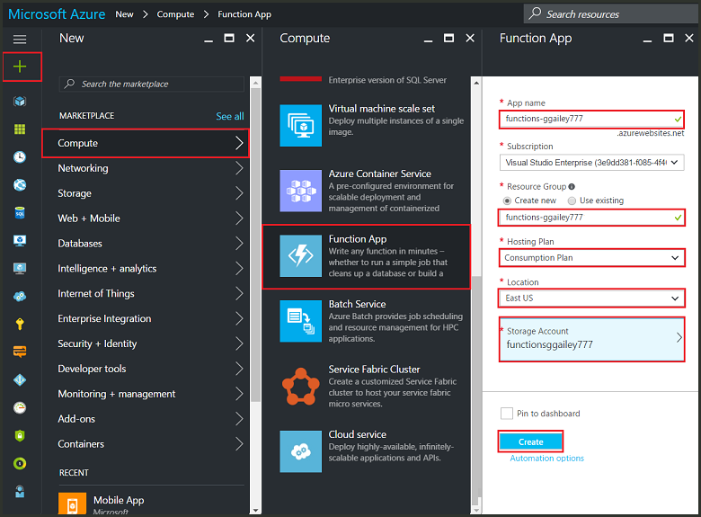
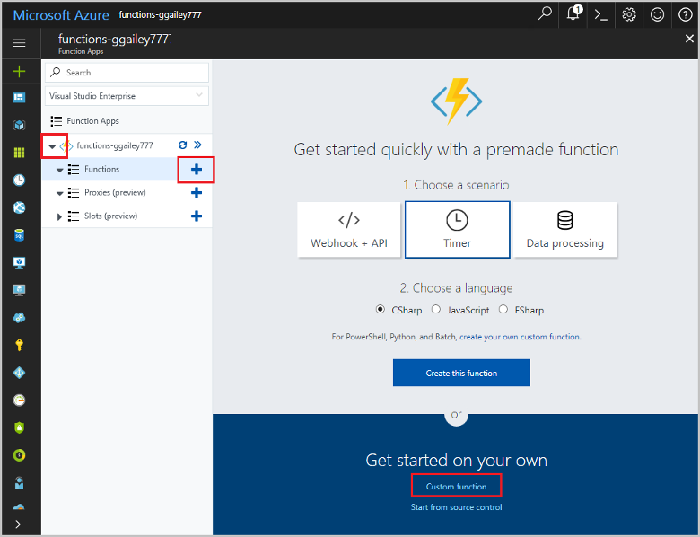

# Lab 4. Create a function triggered by Azure Queue storage

Learn how to create a function triggered when messages are submitted to an Azure Storage queue.

## Prerequisites

- Download and install the [Microsoft Azure Storage Explorer](http://storageexplorer.com/).

- An Azure subscription. If you don't have one, create a [free account](https://azure.microsoft.com/free/?WT.mc_id=A261C142F) before you begin.

## Favorite Functions in the portal 

If you haven't already done so, add Function Apps to your favorites in the Azure portal. This makes it easier to find your function apps. If you have already done this, skip to the next section. 

1. Log in to the [Azure portal](https://portal.azure.com/).

2. Click the arrow at the bottom left to expand all services, type `Functions` in the **Filter** field, and then click the star next to **Function Apps**.  
 
    

    This adds the Functions icon to the menu on the left of the portal.

3. Close the menu, then scroll down to the bottom to see the Functions icon. Click this icon to see a list of all your function apps. Click your function app to work with functions in this app. 
 
    

## Create an Azure Function app

1. Click the **New** button found on the upper left-hand corner of the Azure portal.

1. Click **Compute** > **Function App**. Then, use the function app settings as specified in the table.

    

    | Setting      | Suggested value  | Description                                        |
    | ------------ |  ------- | -------------------------------------------------- |
    | **App name** | Globally unique name | Name that identifies your new function app. Valid characters are `a-z`, `0-9`, and `-`.  | 
    | **Subscription** | Your subscription | The subscription under which this new function app will be created. | 
    | **Resource Group** |  myResourceGroup | Name for the new resource group in which to create your function app. | 
    | **Hosting plan** |   Consumption plan | Hosting plan that defines how resources are allocated to your function app. In the default **Consumption Plan**, resources are added dynamically as required by your functions. You only pay for the time your functions run.   |
    | **Location** | West Europe | Choose a location near you or near other services your functions will access. |
    | **Storage account** |  Globally unique name |  Name of the new storage account used by your function app. Storage account names must be between 3 and 24 characters in length and may contain numbers and lowercase letters only. You can also use an existing account. |

1. Click **Create** to provision and deploy the new function app.

Next, you create a function in the new function app.

## Create a Queue triggered function

1. Expand your function app and click the **+** button next to **Functions**. If this is the first function in your function app, select **Custom function**. This displays the complete set of function templates.

    

2. Select the **QueueTrigger** template for your desired language, and  use the settings as specified in the table.

    
    
    | Setting | Suggested value | Description |
    |---|---|---|
    | **Name your function** | Unique in your function app | Name of this queue triggered function. |
    | **Queue name**   | myqueue-items    | Name of the queue to connect to in your Storage account. |
    | **Storage account connection** | AzureWebJobStorage | You can use the storage account connection already being used by your function app, or create a new one.  |    

3. Click **Create** to create your function.

Next, you connect to your Azure Storage account and create the **myqueue-items** storage queue.

## Create the queue

1. In your function, click **Integrate**, expand **Documentation**, and copy both **Account name** and **Account key**. You use these credentials to connect to the storage account in Azure Storage Explorer. If you have already connected your storage account, skip to step 4.

    

1. Run the [Microsoft Azure Storage Explorer](http://storageexplorer.com/) tool, click the connect icon on the left, choose **Use a storage account name and key**, and click **Next**.

    

1. Enter the **Account name** and **Account key** from step 1, click **Next** and then **Connect**.

    

1. Expand the attached storage account, right-click **Queues**, click **Create Queue**, type `myqueue-items`, and then press enter.

    

Now that you have a storage queue, you can test the function by adding a message to the queue.

## Test the function

1. Back in the Azure portal, browse to your function, expand the **Logs** at the bottom of the page, and make sure that log streaming isn't paused.

1. In Storage Explorer, expand your storage account, **Queues**, and **myqueue-items**, then click **Add message**.

    

1. Type your "Hello World!" message in **Message text** and click **OK**.

1. Wait for a few seconds, then go back to your function logs and verify that the new message has been read from the queue.

    

1. Back in Storage Explorer, click **Refresh** and verify that the message has been processed and is no longer in the queue.
