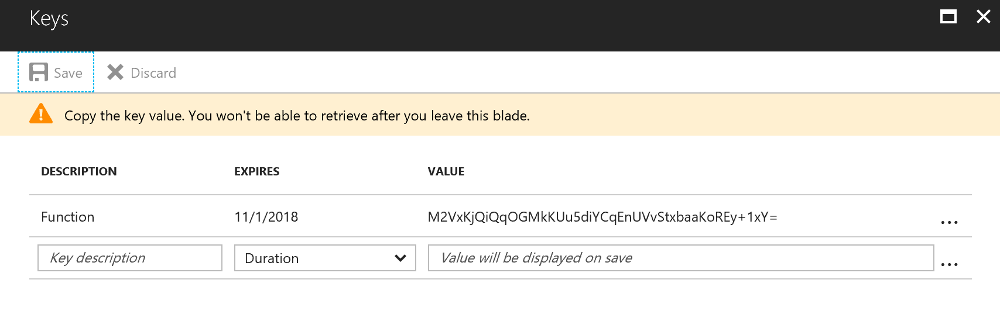
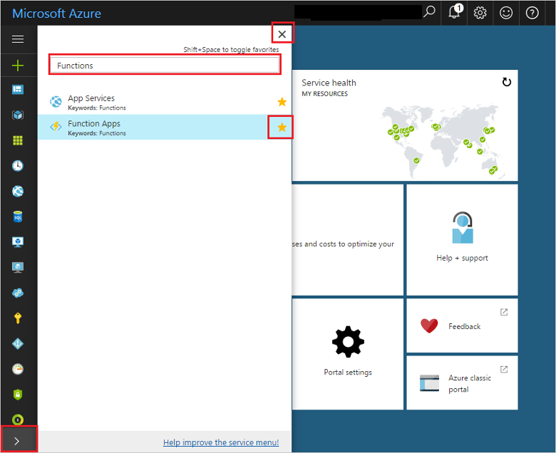

# Lab 5. Calling Microsoft Graph from a Function

We are working on a business case where our Azure Function need to make request to Microsoft Graph using App-only authentication.

To make its happen, we need to register the Azure Function as an Azure AD application on our Office 365 tenant, and use this app credentials to make http request.  

## Log in to Azure to register a new App

Log in to the [Azure portal](https://portal.azure.com/).

## Register a new App on Azure AD blade

On Azure Portal, go to the Azure Active Directory blade. 


Under **App Registration** option, click on "New application registration". 


Enter the name of your app, for example FunctionGraph, and the Sign-on URL, like https://FunctionGraph. Don't mind on this URL because our authentication process don't need a good one. 


Find your app on App registrations list and select to navigate to its settings page. 


On Settings page, we need to do the following tasks:

1. Copy the Application ID as our Client ID, we'll use it later to authenticate our request.


2. Generate a new Key, this key will be the Client Secret.



3. Grant the neccesary permissions to access Microsoft Graph API 


4. Grant Permissions to all acounts using the following button on permissions page


Once you finished this tasks, you are ready to create the function and write down the code to use Only-App authentication. 

## Create a function app

You must have a function app to host the execution of your functions. A function app lets you group functions as a logic unit for easier management, deployment, and sharing of resources. 

1. Click the **New** button found on the upper left-hand corner of the Azure portal.

1. Click **Compute** > **Function App**. Then, use the function app settings as specified in the table.

    

    | Setting      | Suggested value  | Description                                        |
    | ------------ |  ------- | -------------------------------------------------- |
    | **App name** | Globally unique name | Name that identifies your new function app. Valid characters are `a-z`, `0-9`, and `-`.  | 
    | **Subscription** | Your subscription | The subscription under which this new function app will be created. | 
    | **Resource Group** |  myResourceGroup | Name for the new resource group in which to create your function app. | 
    | **Hosting plan** |   Consumption plan | Hosting plan that defines how resources are allocated to your function app. In the default **Consumption Plan**, resources are added dynamically as required by your functions. You only pay for the time your functions run.   |
    | **Location** | West Europe | Choose a location near you or near other services your functions will access. |
    | **Storage account** |  Globally unique name |  Name of the new storage account used by your function app. Storage account names must be between 3 and 24 characters in length and may contain numbers and lowercase letters only. You can also use an existing account. |

1. Click **Create** to provision and deploy the new function app.

## Favorite Functions in the portal 

If you haven't already done so, add Function Apps to your favorites in the Azure portal. This makes it easier to find your function apps. If you have already done this, skip to the next section. 

1. Log in to the [Azure portal](https://portal.azure.com/).

2. Click the arrow at the bottom left to expand all services, type `Functions` in the **Filter** field, and then click the star next to **Function Apps**.  
 
    

    This adds the Functions icon to the menu on the left of the portal.

3. Close the menu, then scroll down to the bottom to see the Functions icon. Click this icon to see a list of all your function apps. Click your function app to work with functions in this app. 
 
    

Next, you create a function in the new function app.

## <a name="create-function"></a>Create an HTTP triggered function

1. Expand your new function app, then click the **+** button next to **Functions**.

2.  In the **Get started quickly** page, select **WebHook + API**, **Choose a language** for your function, and click **Create this function**. 
   
    

A function is created in your chosen language using the template for an HTTP triggered function. You can run the new function by sending an HTTP request.

## Get an access token

Open the code editor of the function and write down the following code. 

```csharp
    // The resourceId variable is the resource we want to access once we have a token
    string resourceId = "https://graph.microsoft.com";
    string tenantId = "<Office 365 Tenant ID>";
    string clientId = "Client ID";
    string clientSecret = "Client Secret";
    string authString = "https://login.microsoftonline.com/"+tenantId;

    var authenticationContext = new AuthenticationContext(authString, false);

    ClientCredential clientCred = new ClientCredential(clientId, clientSecret);
    AuthenticationResult authenticationResult = await authenticationContext.AcquireTokenAsync(resourceId, clientCred);

    string token = authenticationResult.AccessToken;
    log.Verbose("token: " + token.ToString().Substring(0,10) + "...");
```

Add the following "using" clause at the beginning of the csx file. 

```csharp
#r "Newtonsoft.Json"
#r "System.Configuration"
#r "System.Collections"

using System;
using System.Net;
using System.Text;
using System.Configuration;
using System.Collections.Generic;
using System.Security.Claims; 
using System.Net.Http.Headers;
using Newtonsoft.Json;
using Microsoft.IdentityModel.Clients.ActiveDirectory;
```

Also, we need to import a nuget package for Microsoft.IndentityModel.Clients.ActiveDirectory assembly. To to this, create a new file, "project.json", on the "View files" blade from the code editor. 


Using the following definition, we'll import necessary nuget packages on the Azure Function. 

```json
{  
    "frameworks":   
    {     
        "net46":   
        {     
            "dependencies":    
            {     
                "Microsoft.IdentityModel.Clients.ActiveDirectory" : "3.17.0"     
            } 
        }
    } 
}
```

Then, we can use the authentication token to make request to Microsoft Graph API, like the following peace of code that retrieve a user photo. 

```csharp
    string requestUrl = $"https://graph.microsoft.com/v1.0/users/user@dev.encamina.com/photo";
    
    HttpClient client = new HttpClient();
    client.DefaultRequestHeaders.Authorization = new AuthenticationHeaderValue("Bearer", token);

    var request = await client.GetAsync(requestUrl);
    log.Info(await request.Content.ReadAsStringAsync());
```

Now that you have a function request user photo from Microsoft Graph, you can test by using the test blade.

## Test the function

1. Back in the Azure portal, browse to your function, expand the **Logs** at the bottom of the page, and make sure that log streaming isn't paused.

2. Expand the **Test** to make a request to our function, adding a query parameter. 

3. Click run to execute the test and view the result on Output window. 


