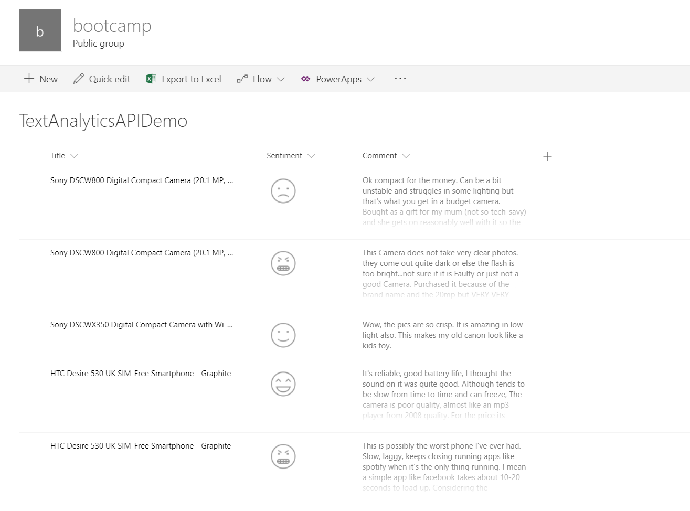
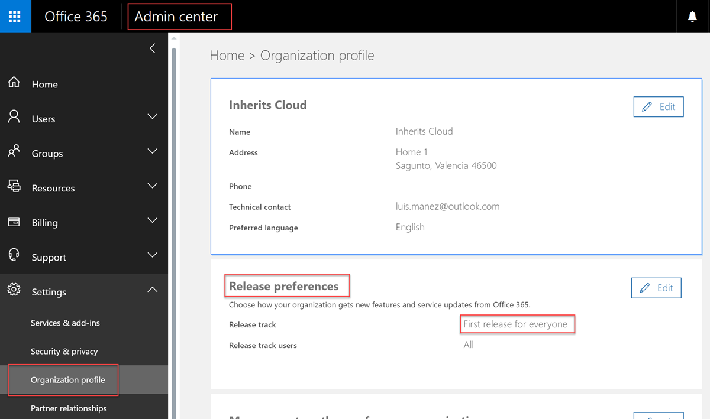
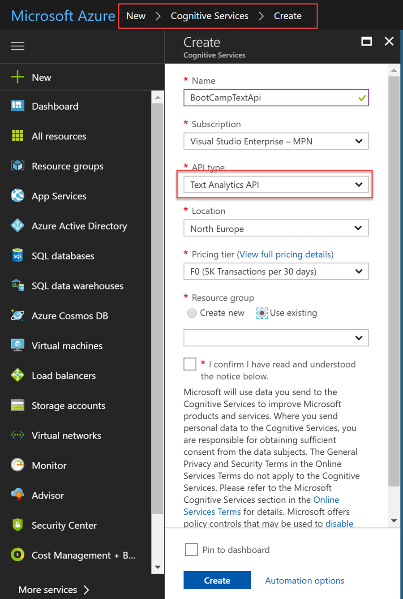
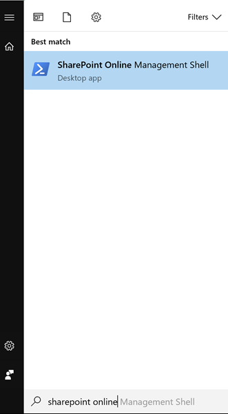
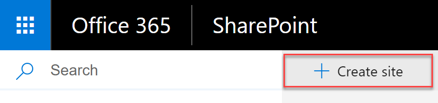
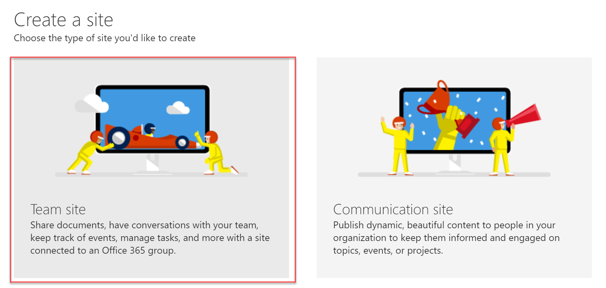
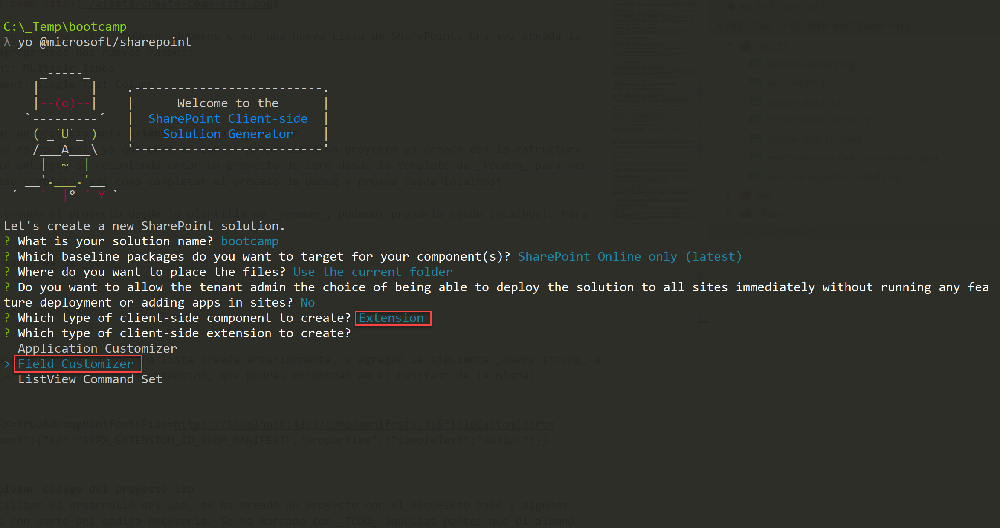

# Office365 Developer Bootcamp 2017

En este repo podrás encontrar el material utilizado en el Office 365 Developer Bootcamp 2017 en Madrid, durante el cual hice una sesión sobre como utilizar Cognitive Services con spfx.

## Demo mostrada durante la sesión teórica
Durante la sesión teórica, vimos una demo sobre como utilizar la Vision API para extraer información de imágenes. Puedes encontrar la el proyecto de la demo en mi Fork del repositorio del PnP para spfx-extensions: [https://github.com/luismanez/sp-dev-fx-extensions/tree/react-command-vision-api-v2/samples/react-command-vision-api](https://github.com/luismanez/sp-dev-fx-extensions/tree/react-command-vision-api-v2/samples/react-command-vision-api)

En el momento del bootcamp (4 Nov 2017), este ejemplo se ha enviado como contribución al PnP, pero todavía no ha sido aceptado. En principio estará disponible como parte del PnP en los próximos días.

## Laboratorio
Durante el tiempo dedicado al laboratorio, pondremos en practica algunos de los conceptos mostrados durante la sesión teórica y la demo. 
En este caso, vamos a utilizar la Text Analytics API de Cognitive Services [https://azure.microsoft.com/en-us/services/cognitive-services/text-analytics/](https://azure.microsoft.com/en-us/services/cognitive-services/text-analytics/) para anlizar el sentimiento de un fragmento de texto almacenado en una lista de SharePoint.
Una vez obtenido el 'sentiment', nuestro spfx Field Customiser, lo mostrará utilizando un icono:



### Configurar Tenant Office 365 como 'First release'
Durante el lab queremos utilizar una de las ultimas novedades de Office 365: "Tenant Properties". Para tener esta 'feature' disponible, debemos de configurar nuestra tenant como 'First release', para ello, debemos ir a la seccion 'Admin' dentro de [http://portal.office.com](http://portal.office.com)



### Configurar entorno de desarrollo spfx
Si no lo has hecho ya, antes de empezar a desarrollar con SharePoint framework, tienes que configurar el entorno, para ello sigue los pasos de este link:
[https://docs.microsoft.com/en-us/sharepoint/dev/spfx/set-up-your-development-environment](https://docs.microsoft.com/en-us/sharepoint/dev/spfx/set-up-your-development-environment)

### Registrar servicio Cognitive Services Text Analytics
Para poder utilizar la Text Analytics API de Cognitive Services, primero tenemos que registar el servicio desde el portal de Azure, para asi obtener la Key para invocar la API. 




### Almacenar la Text Analytics API como Tenant Property
Para evitar hard-coded la Key de la API en nuestro codigo, se propone almacenarla como una Tenant Property, y recuperarla utilizando la API que SharePoint ofrece a tal efecto. Para ello, primero de todo debemos asegurarnos que tenemos la ultima verion de los comandos de PowerShell para SharePoint Online, que puede descargar de la siguiente direccion: TODO: link

Con los comandos instalados, abrimos la consola de comandos de SharePoint Online:



Primero, nos conectamos a nuestra Tenant (nos preguntara usuario y password).
__Nota__: es necesario conectar a la URL de Admin
```ps
Connect-SPOService -Url https://YOUR_TENANT-admin.sharepoint.com
```

Para almacenar la Key (Las Tenant Properties se almacenan a nivel de AppCatalog, por lo que el parametro _site_ debe especificar la URL del AppCatalog)
```ps
Set-SPOStorageEntity -Site "https://YOUR_TENANT.sharepoint.com/sites/appcatalog" -Key "TextAPIKey" -value YOUR_KEY_HERE -Description "Key to use Text API" -Comments "O365 Dev Bootcamp 2017"
```

Podemos comprobar que la propiedad se ha creado correctamente con el siguiente comando:
```ps
Get-SPOStorageEntity -Site "https://YOUR_TENANT.sharepoint.com/sites/appcatalog" -Key "TextAPIKey"
```

### Crear Lista de SharePoint para probar nuestro proyecto
__Nota:__ Si no dispones de un sitio _Modern_ ya creado en tu tenant, primero deberas crear un sitio _Modern_, para ello puedes hacerlo desde la opcion _SharePoint_





Una vez en nuestro sitio _Modern_ debemos crear una nueva Lista de SharePoint. Una vez creada la lista, agregaremos dos nuevos campos:
* Comment: Multiple lines
* Sentiment: Single Text Column


### Crear un proyecto spfx extension Field Customiser
Este paso es opcional, ya que para el Lab se proporciona un proyecto ya creado con la estructura base, sin embargo, se recomienda crear un proyecto de cero desde la template de _Yeoman_ para ver el proceso completo, asi como completar el proceso de Debug y prueba desde localhost.



Una vez creado el proyecto desde la plantilla de _yeoman_, podemos probarlo desde localhost. Para ello:

Ejecuta la tarea de _gulp_

```ps
gulp serve --nobrowser
```

Ahora debemos navegar a nuestra lista creada anteriormente, y agregar la siguiente _query string_ a la URL (actualiza el ID de la extension, que podras encontrar en el Manifest de la misma):

```ps
?loadSPFX=true&debugManifestsFile=https://localhost:4321/temp/manifests.js&fieldCustomizers={"Sentiment":{"id":"SPFX_EXTENSION_ID_FROM_MANIFEST","properties":{"sampleText":"Hello!"}}}
```

### Completar código del proyecto lab
Para facilitar el desarrollo del lab, se ha creado un proyecto con el esqueleto base y algunos archivos con parte del codigo necesario. Se ha marcado con _TODO_ aquellas partes que el alumno debe completar siguiendo las indicaciones del propio comentario.

#### SentimentIcon.ts
Abre el fichero _./components/SentimentIcon.ts_

Este fichero define lo que en ReactJS se llama un "_Dumb component_". Estos son componentes que no tienen estado. Simplemente tienen propiedades que son inmutables, y que le son asignadas desde el componente padre. Los _Dumb components_ devuelven un fragmento de HTML segun sus propiedades.

Completa los comentarios marcados con _TODO_

* Linea 20: llama a la funcion _scoreToIcon con el score pasado en las props del Component
* Linea 24: render un  tag con el _src_ apuntando a la imagen obtenida previamente

#### SentimentAnalyticsFieldCustomizer.ts

Abre el fichero _SentimentAnalyticsFieldCustomizer.ts_ y completa los comentarios marcados con _TODO_

* Linea 42: Obtener el ID y Comment del Field: _event.listItem.getValueByName('ID')_ para el Comment el field se llama 'Comment'
* Linea 46: Pasar el _id_, _title_ y las propiedades del contexto (_this.context_): _httpClient_, _spHttpClient_, _absoluteUrl_ al componente de React

#### SentimentAnalytics.tsx
Este es el componente React principal (lo que en React se denomina un _Smart Component_), que se encarga de hacer la llamada a la API de SharePoint Tenant Properties para obtener la Key de la Text API, y luego al servicio de Text Analytics API para obtener la puntuacion de _sentiment_

Abre el fichero SentimentAnalytics.ts_ y completa los comentarios marcados con _TODO_

* Linea27: Desde el portal de Azure, obtén la URL para invocar la Text API. Tambien la puedes obtener del siguiente enlace [https://westus.dev.cognitive.microsoft.com/docs/services/TextAnalytics.V2.0/operations/56f30ceeeda5650db055a3c7](https://westus.dev.cognitive.microsoft.com/docs/services/TextAnalytics.V2.0/operations/56f30ceeeda5650db055a3c7)
* Linea 33: establece el state del componente para que el score inicial sea 0
* Linea 60: Usa el componente SentimentIcon, pasandole el score del state
* Linea 69: usando async/await, haz una llamada a la API de SharePoint para sacar la Tenant Property TextAPIKey para ello, tendrás que componer una URL usando la props 'absoluteUrl' + endpoint, y el spHttpClient para la llamada a la API el endpoint para sacar la Key es: /_api/web/GetStorageEntity('TextAPIKey') el método Get necesita como segundo argumento un objeto ISPHttpClientConfigurations. La propiedad estática SPHttpClient.configurations.v1 te lo dará
* Linea 74: obtiene el json de 'SPHttpClientResponse'
* Linea 80: de nuevo con async/await y usando el httpClient de las props del component, haz un POST al Endpoint de la Text API (tienes una propiedad privada de la clase con ese valor) para el post, necesitarás un segundo argumento del tipo IHttpClientConfigurations: HttpClient.configurations.v1, y como tercer argumento, el objeto httpOptions de la linea anterior
* Linea 85: obtiene el json de 'HttpClientResponse'
* Linea 98 siguiendo el ejemplo de aquí:  https://westus.dev.cognitive.microsoft.com/docs/services/TextAnalytics.V2.0/operations/56f30ceeeda5650db055a3c9 crea un objeto documents con language, id, text
* Linea 120: añade otro Header 'Ocp-Apim-Subscription-Key' y asígnale el valor de la TextAPI Key, que ya almacenaste en una variable privada

#### Ejecuta la extension desde Localhost
Lanza:
```ps
gulp serve --nobrowser
```

Desde la Lista de SP creada en un paso anterior, agrega la siguiente _query string_ para ejecutar la extension desde localhost:

```ps
?loadSPFX=true&debugManifestsFile=https://localhost:4321/temp/manifests.js&fieldCustomizers={"Sentiment":{"id":"537f4524-0444-46dd-b71b-3e9298e19338","properties":{"sampleText":"Hello!"}}}
```
      
            